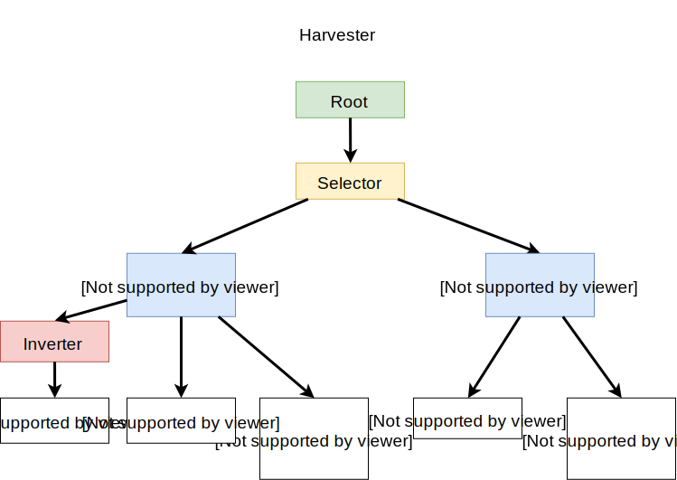
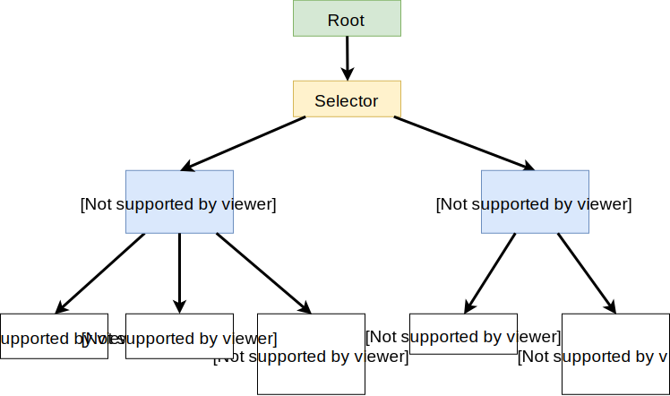

# EmperLex screeps AI

## Foreword
I dont use scripts from other players beside the tutorial ones because it
may ruin my game experience. Therefore the AI might be terrible, naive
and highly inefficient but thats the way i want to approach my problem solving.

## Logbook
### Phase 1 Being naive ...
Implement naive energy collection just on the shortest energy patch from the first spawn point.
Respawned new creeps until room cap and just used moveTo() pathfinding.

Problems occured:
- Massive amount of probes trying to harvest the same patch
- Deadlock because of probes blocking each others path
- Memory is increasing since Memory.creep is not cleaned up

### Phase 2 Clean up memory & find way for non blocking mining
Clean up memory regulary but not every tick.

Idea to find the number of probes possible to send to a patch from a certain position
without the risk of deadlock (hopefully):

create new temporary cost matrix
find all destinations (spawns, romm controllers)

for every destination
  for each energy patch

      find a path to it

      if (path found)
        Memory.destination[energy_patch]++
        for every tile of the path
          adapt cost matrix weight of tile to unwalkable
        end for
      else
        break
      endif    

  end for
end for

This might be pretty resource hungry. We will see...

Problems occured:
- needed about 3h to find a problem with the PathFinder.search function. In the end the root cause was that the cost matrix i wanted to store in the Memory will lose its functions. Reading the matrix and passing it to the search function lead to strange error like "v.get is not a function". The solution is to serialize and deserialize the matrix to and from the Memory.
- there was a lot of fine tuning to do and the code got pretty messy. It probably would make sense to think about a good strict architecture to keep things clean.
- solution works but does not feel very flexible

### Phase 3 Clean up and follow a general architectural idea
After reading some theory about finite state machines, hierarchical finite state machines and behaviour trees I decided to implement the AI behaviour as behaviour trees. This was major design work.

Resources I found useful:
https://www.gamasutra.com/blogs/ChrisSimpson/20140717/221339/Behavior_trees_for_AI_How_they_work.php
http://www.csc.kth.se/~miccol/Michele_Colledanchise/Publications_files/2013_ICRA_mcko.pdf
http://blog.renatopp.com/2014/09/24/implementing-a-behavior-tree-part-1/

Now the harvester (formerly probe) is now based on a simple behaviour tree:


The creeps are still stupid as hell but the framework allows to adapt their behaviour much easier than before.

### Phase 4 Port behaviour tree to upgrader
The next goal is to do the same with the upgrade creep. Since the logic is nearly the same with the exception
of some APIs calls because of the different types of structures involved I want to generalize the behaviours that much
so that both roles can be handled with a very similar tree configuration and as less behaviour subclasses as possible.

For this the behaviours got generalized and can now be parametrized. E.g. instead of a having a MoveToSource-behaviour
there now is a MoveTo behaviour were the target id can be determined by a passed callback function.



There is just one little detail why this tree cannot be used for the upgrader creep. When harvesting energy we do

```
while(inventory not full) {
  harvest from energy source // requires multiple ticks
}
hand over to spawn // takes one tick
```

For the upgrader we have ...

```
while(inventory not full) {
  take energy from spawn // requires one tick
}
hand over to controller // takes multiple ticks
```

This is very inefficient because
 - we go to the spawn and fill the inventory
 - then go to the controller and transfer one energy to it
 - which leads to "inventory not full" condition

and so we just transfer one energy each turn. A minor adapted tree solves the problem:



Other notable issues:
- found out that transfer and updateController can both update the controller but I am not sure wether the
bonuses of updateController() will be applied to transfer as well.
- room controllers can be upgraded with a range of 3. MoveTo now takes a range param which defines
when a goal is reached. This will further improve the upgrader efficiency.
